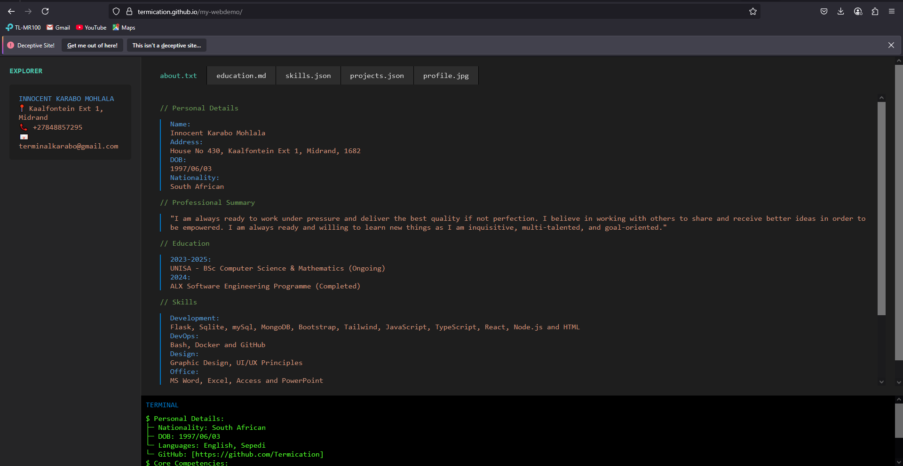

# 💻 VS Code Themed Portfolio Website

[](https://flask.palletsprojects.com/)
[](https://opensource.org/licenses/MIT)




A Visual Studio Code inspired portfolio website showcasing professional information in a developer-friendly interface. Built with pure HTML and CSS. 🚀

## 🎯 Features

- 🌙 **VS Code Dark Theme**: Authentic color scheme and styling
- 📂 **Interactive Tabs System**: 
  - 📝 About Me (about.txt)
  - 🎓 Education (education.md)
  - 🛠️ Skills (skills.json)
  - 📸 Profile Image (profile.jpg)
- 💻 **Terminal Panel**: Displays key personal details and competencies
- 📱 **Responsive Design**: Optimized for various screen sizes
- 🎨 **Syntax Highlighting**: Code-style presentation of information
- 🗄️ **File System Navigation**: Explorer-style sidebar

## ⚙️ Installation

1. Clone the repository:

```bash
git clone https://github.com/Termication/my-webdemo.git
```

2. Open HTML file with browser:

```bash
# For default browser
start index.html  # Windows
xdg-open index.html  # Linux
open index.html  # macOS
```

# AUTHORS

<details>
    <summary>Innocent Karabo Mohlala</summary>
    <ul>
    <li><a href="https://www.github.com/termication">Github</a></li>
    <li><a href="https://www.twitter.com/Termication_">Twitter</a></li>
    <li><a href="mailto:terminalkarabo@gmail.com">e-mail</a></li>
    </ul>
</details>
